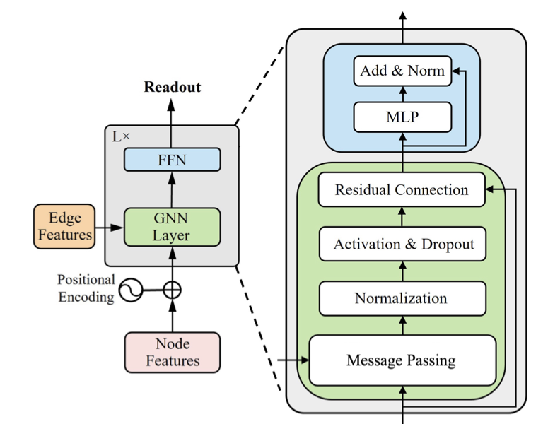

# Graph Classification under noisy labels - DEEP Learning Hackathon

**Competition Submission for [Hackathon on Graph Learning with Noisy Labels](https://sites.google.com/view/hackathongraphnoisylabels/rules?authuser=0)**

Our solution tackles the challenge of building robust graph neural networks that can effectively learn from noisy node labels across four different datasets (A, B, C, D).

- - -

## 🚀 Solution Overview

**Core Architecture: Gated Graph Convolutional Network (GatedGCN)**

Our implementation leverages the GatedGCN architecture enhanced with GNN<sup>+</sup>, following the methodology described in *"*Unlocking the Potential of Classic GNNs for Graph-level Tasks: Simple Architectures Meet Excellence*"* by Luo et al., 2025 ([arXiv:2502.09263v1](https://arxiv.org/pdf/2502.09263v1)).

The key innovation lies in the gated message passing mechanism, which enables adaptive filtering and aggregation of neighbor information, making the model particularly resilient to label noise.

<div align="center">
    
</div>

- - -

## 📋 Experimental Configuration

Our approach involves dataset-specific hyperparameter tuning to optimize performance under noisy conditions. Each dataset receives a tailored configuration based on its characteristics and noise patterns.

- **Datasets A, B, C**: Powered by **GatedGCN** with loss function adaptation:
  - **Datasets A, B, C**: Feature Generalized Cross-Entropy (GCE) loss with distinct q settings
- **Dataset D**: Employs **GIN-Virtual** baseline architecture with GCE loss integration

**Training Settings:**

- **Datasets A, B, C**
    * Training Duration: 300 epochs
    * GCE: q=0.5 for A and C, q=0.9 for B.
    * Architecture: 3-layer GNN with residual connections and batch normalization

- **Dataset D**
    * Training Duration: 200 epochs
    * GCE loss function with q=0.5.
    * Architecture: 5-layer GNN with residual connections and batch normalization
- - -

## 🔧 How to run the code

**Setup Instructions:**
   
Navigate to your project directory:

``` bash
cd DL_Hackaton
```
1. **Environment Setup**

``` bash
pip install -r requirements.txt
```

2. **Model Training**
   
Execute training for each dataset:

``` bash
python main.py --test_path <path_to_test_data> --train_path <path_to_train_data>
```

3. **Results**
   
Training outputs (checkpoints, logs, results) are automatically saved in their respective directories.

4. **Zip the results in `/submission/` folder:**
``` bash
python zipthefolder.py
```
5. **Test the model**

Execute the following command:
``` bash
python main.py --test_path <path_to_test_data> 
```
The best model for the associated test set will be loaded and it will generate the predictions.
- - -

## 📝 Additional Information

**Development Team:** Fabrizio Italia & Giada Piacentini

**Repository Structure:**

* `/source/` \- Implementation code
* `/requirements.txt` \- Dependency specifications
* `/logs/` \- Training logs for each dataset
* `/checkpoints/` \- Checkpoints and best models for each dataset
* `/submission/` \- Final csv predictions
